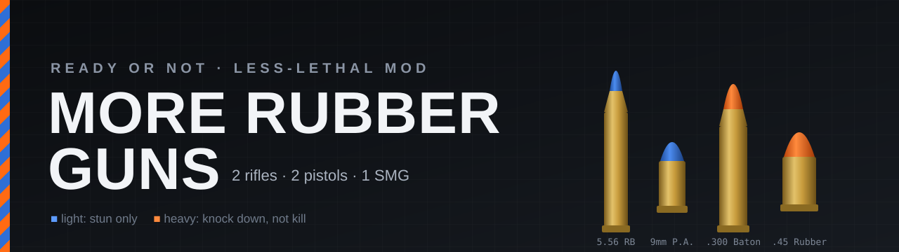

<p align="center">
  
</p>

<p align="center">
  <a href="README.md">English</a> · <b>Русский</b>
</p>

<p align="center">
  <a href="https://github.com/RGB-Outl4w/MoreRubberGuns/releases/latest"></a>
  
  
  <a href="LICENSE"></a>
  <a href="https://boosty.to/rgboutlaw"></a>
</p>

**More Rubber Guns** добавляет в Ready or Not пять образцов оружия под резиновые пули: две штурмовые винтовки, два пистолета и пистолет-пулемёт. Ванильный травматический дробовик больше не единственное нелетальное длинноствольное оружие.

Каждый ствол - полноценное оружие, собранное из ассетов самой игры: настоящие модели и анимации, полный список обвесов, выверенные прицелы, свой резиновый патрон и свои характеристики. Каждый относится к одному из двух классов:

- 🔵 **Лёгкий («Стингер»)**: каждое попадание оглушает и склоняет цель к сдаче, но никогда не ранит.
- 🟠 **Тяжёлый («Дубинка»)**: бьёт достаточно сильно, чтобы сбить подозреваемого с ног - раненым, но живым.

> [!NOTE]
> UE4SS и другие загрузчики не нужны. Мод - это один `.pak`, который нужно положить в папку игры.

## Содержание

- [Возможности](#возможности)
- [Арсенал](#арсенал)
- [Как это играется](#как-это-играется)
- [Установка](#установка)
- [Совместимость](#совместимость)
- [Сборка из исходников](#сборка-из-исходников)
- [Как это устроено](#как-это-устроено)
- [Поддержать проект](#поддержать-проект)
- [Лицензия и благодарности](#лицензия-и-благодарности)

## Возможности

- **5 новых стволов** во вкладках **Less Lethal** (нелетальное) экипировки: 2 штурмовые винтовки и пистолет-пулемёт в основном слоте, 2 пистолета во вторичном.
- **Два класса урона** с разным поведением:
  - лёгкие стволы оглушают;
  - тяжёлый пистолет сбивает с ног;
  - тяжёлая винтовка требует плотного огня, потому что подозреваемые быстро стряхивают её оглушение и сопротивляются.
- **Настоящие травматические патроны** со своими записями боеприпасов: 5,56x45 RB, .300 BLK «Дубинка», 9 мм Р.А. и .45 Rubber.
- **Цветовая маркировка:** синее учебное (Simunition) исполнение у лёгких стволов, оранжевое нелетальное у тяжёлых.
- **Все слоты обвеса** исходного оружия, все прицелы правильно выверены. Глушители убраны.
- **Видимый след снаряда**, чтобы было видно, куда попадают пули. Без крови и без пулевых отверстий.
- **Считается нелетальной силой** для правил применения силы (ROE), как травматический дробовик и тазер.
- **Английский и русский.** При русском языке игры тексты на русском, при любом другом на английском.

## Арсенал

| | MK18 «Стингер» | MP5 «Стингер» | LVAR «Дубинка» | G19 «Стингер» | 1911 «Дубинка» |
|---|:---:|:---:|:---:|:---:|:---:|
| **Слот** | Основной · ШВ | Основной · ПП | Основной · ШВ | Вторичный | Вторичный |
| **Класс** | 🔵 Лёгкий | 🔵 Лёгкий | 🟠 Тяжёлый | 🔵 Лёгкий | 🟠 Тяжёлый |
| **Патрон** | 5,56x45 мм RB | 9 мм Р.А. (9x22) | .300 BLK «Дубинка» | 9 мм Р.А. (9x22) | .45 Rubber (11,43x22) |
| **Магазин** | 30 | 30 | 30 | 15 | 7 |
| **Режимы огня** | Одиночный / Авто | Одиночный / Авто | Одиночный / Авто | Одиночный | Одиночный |
| **Темп стрельбы** | 700 выстр/мин | 800 выстр/мин | 750 выстр/мин | - | - |
| **Начальная скорость** | ~180 м/с | ~350 м/с | ~260 м/с, дозвуковая | ~330 м/с | ~220 м/с |
| **Ствол** | 262 мм | 225 мм | 140 мм, интегрированный глушитель | 102 мм | 127 мм |
| **Урон здоровью за попадание** | 0,1 | 0,1 | 40 | 0,1 | 65 |
| **Попаданий в корпус, чтобы свалить подозреваемого** | никогда | никогда | ~5 | никогда | 3 (2 в упор) |
| **Попаданий в корпус, чтобы свалить гражданского** | никогда | никогда | 3 | никогда | 2 |

<details>
<summary><b>Обвесы по стволам</b></summary>

Каждый ствол получает полный список исходного оружия, без глушителей.

- **MK18 «Стингер»**
  - Прицелы: целик на ручке для переноски, SRS, Micro T-2 (на возвышении), M5B, HS510C, EXPS3, BOSS Xe, SDR, MRO HD 3x
  - Дульные устройства: компенсатор ASR, тормоз SFMB, ствол 14"
  - Подствольные: VFG, AFG, боевая рукоять, RK-1, CQR
  - Надствольные: лазер, PEQ, MAWL
  - Фонарь: M600V
  - Магазин: PMAG
- **MP5 «Стингер»**
  - Прицелы: RMR (на кронштейне), SRO, Micro T-2, Aimpro, HS510C, EXPS3, BOSS Xe
  - Подствольные: VFG, AFG, боевая рукоять, RK-1
  - Надствольные: лазер, PEQ
  - Фонарь: Inforce WML
- **LVAR «Дубинка»**
  - Прицелы: SRS, Micro T-2 (на возвышении), M5B, HS510C, EXPS3, BOSS Xe, SDR, ATACR, MRO HD 3x
  - Наклонный механический прицел
  - Подствольные: AFG, боевая рукоять, VFG, RK-1
  - Надствольные: MAWL, лазер, PEQ
  - Фонари: M600V, Inforce WML
- **G19 «Стингер»**
  - Прицелы: SRO, RMR
  - Дульное устройство: компенсатор
  - Подствольные: лазер, фонарь, ИК-лазер, Steiner PL
- **1911 «Дубинка»**
  - Прицелы: SRO, RMR
  - Дульное устройство: двухкамерный компенсатор
  - Подствольные: фонарь, лазер

</details>

## Как это играется

**🔵 Лёгкие стволы: MK18, MP5, G19.** Каждое попадание оглушает цель, как травматический дробовик, и ломает её волю к сопротивлению, так что пара попаданий обычно ставит подозреваемого на колени. Урон символический - 0,1 за попадание, поэтому даже полный магазин никого не свалит.

**🟠 1911 «Дубинка».** Работает как ванильный травматический дробовик, только мощнее. Каждое попадание сильно оглушает и сильно бьёт по морали. Если подозреваемый всё равно не подчиняется, 3 попадания в корпус сбивают его с ног (2 в упор).

**🟠 LVAR «Дубинка».** Эта винтовка рассчитана на плотный огонь. Каждое попадание оглушает, но подозреваемый поднимает оружие уже через полсекунды и почти не теряет мораль. Он остаётся враждебным, а сократить дистанцию в 10–20 м, пока он не пришёл в себя, не получится. Продолжайте стрелять: примерно 5 попаданий в корпус сбивают подозреваемого с ног.

> [!WARNING]
> Как и у ванильного травматического дробовика, **выстрелы в голову и в упор** из тяжёлых стволов могут убить. Цельтесь в корпус.

<details>
<summary><b>Цифры под капотом</b></summary>

Измерено на стандартной сложности.

| | |
|---|---|
| Здоровье подозреваемого | 360 |
| Здоровье гражданского | 200 |
| Выведен из строя (сбит с ног) при | 50% здоровья и ниже |
| Оглушение от резиновой пули | ~3 с |
| Потеря морали за попадание, лёгкие стволы и 1911 | ~0,2–0,25 |
| Потеря морали за попадание, LVAR | ~0,1–0,14 |
| Стартовая мораль подозреваемого | 0,65–0,9 |
| LVAR: оружие снова поднято через | 0,5 с (дробовик: 4 с) |
| Бонус тяжёлых стволов в упор | +25 урона |
| Урон тяжёлых стволов в голову | ×2, затем +50 |

</details>

## Установка

1. Скачайте `pakchunk99-Mods_MoreRubberGuns_P.pak` из [последнего релиза](https://github.com/RGB-Outl4w/MoreRubberGuns/releases/latest).
2. Скопируйте его в `…\steamapps\common\Ready Or Not\ReadyOrNot\Content\Paks\`.
3. Запустите игру. Откройте **Экипировку** и перейдите в **Основное → Less Lethal** или **Вторичное → Less Lethal**.

Чтобы удалить мод, удалите `.pak`.

> [!IMPORTANT]
> **Мультиплеер:** мод нужен каждому игроку в лобби.

## Совместимость

- Собран под Steam-сборку Ready or Not **24942528** (сентябрь 2026, Unreal Engine 5.3).
- Крупное обновление игры может сломать мод. В этом случае пересоберите его ([ниже](#сборка-из-исходников)) или дождитесь обновлённого релиза.
- Мод добавляет новый контент и дополняет несколько ванильных файлов. **Другие моды, которые заменяют эти файлы, будут с ним конфликтовать**, и сработает тот, что загрузится последним:

  | Файл | Что добавляет мод |
  |---|---|
  | `Blueprints/DataTables/AmmoDataTable` | 4 типа резиновых патронов |
  | 17 блюпринтов прицелов и прицел на ручке для переноски из DLC4 | Выверка прицелов для новых стволов |
  | 5 ассетов DLC4 `*_AttachmentData` | Анимации переключения магнификатора |
  | `Localization/EngineOverrides/ru/EngineOverrides.locres` | Русские тексты |

## Сборка из исходников

Релизный `.pak` создаётся скриптом `build.py` прямо из установленной игры. Ничего, принадлежащего VOID, в репозитории не хранится. После патча игры можно пересобрать мод под новые файлы:

```bash
python build.py --install
```

<details>
<summary><b>Первичная настройка</b></summary>

1. **Требования:** Windows, [Python 3.10+](https://www.python.org/) и [.NET 8 Desktop Runtime](https://dotnet.microsoft.com/download/dotnet/8.0).
2. **Инструменты**, положите в `tools/`:
   - [`repak.exe`](https://github.com/trumank/repak/releases)
   - [`UAssetGUI.exe`](https://github.com/atenfyr/UAssetGUI/releases)
3. **Маппинги типов:**
   1. Установите [UE4SS](https://github.com/UE4SS-RE/RE-UE4SS) и запустите игру.
   2. Нажмите **Ctrl+Numpad6** - это команда UE4SS `DumpUSMAP`.
   3. Скопируйте получившийся `.usmap` из `Binaries\Win64\ue4ss\` в `tools\Mappings.usmap`.
   4. Повторяйте после крупных обновлений игры.
4. **Папка игры** находится автоматически через библиотеки Steam. Если не нашлась, задайте переменную `RON_DIR` - путь к папке, в которой лежит `ReadyOrNot\`.

`python build.py` создаёт `build/pakchunk99-Mods_MoreRubberGuns_P.pak`, а с `--install` ещё и копирует его в игру. `python test_build.py` проверяет логику правки ассетов без игры.

</details>

Все параметры баланса и тексты (английские и русские) находятся в таблицах `DAMAGE_TYPES`, `AMMO` и `WEAPONS` в начале [`build.py`](build.py):
- `damage`: урон здоровью за попадание
- `dt`: поведение оглушения
- `velocity`: начальная скорость, она же скорость снаряда
- цвета, названия и описания

## Как это устроено

<details>
<summary><b>Техническое описание</b></summary>

Сборка работает напрямую с запечёнными (cooked) ассетами игры: без Unreal Editor и без SDK.

1. **Извлечение.** `repak` распаковывает из паков игры ванильные блюпринты оружия, меши, материалы, типы урона и таблицы данных. `UAssetGUI` переводит их в JSON с помощью снятых маппингов типов.
2. **Клонирование оружия.** Каждый ствол - переименованная копия ванильного блюпринта (MK18, MP5A3, LVAR, G19, TLE 1911), поэтому у него остаются анимации, сокеты, звуки и слоты обвесов оригинала. Экипировка показывает любой блюпринт `BaseItem` внутри `/Game`, так что копии появляются в ней сами.
3. **Перевод на резину:**
   - новые строки `AmmoDataTable` задают резиновые патроны;
   - стволы стреляют снарядами, как травматический дробовик, вместо мгновенного попадания (hitscan);
   - урон проходит через нелетальный тип урона:
     - **лёгкие:** клон травматического урона без урона здоровью;
     - **тяжёлый пистолет:** ванильный травматический урон;
     - **тяжёлая винтовка:** клон травматического урона с типом оглушения игры *rubberball* (вдвое меньше потери морали) и опусканием оружия на 0,5 с.
4. **Перекраска.** Скелетный меш клонируется, а каждый его материал заменяется копией, у которой текстура базового цвета - сгенерированная синяя или оранжевая текстура 1×1. Карты нормалей и шероховатости сохраняются, поэтому получается крашеное учебное или нелетальное исполнение.
5. **Выверка прицелов.** Ванильные прицелы хранят смещения отдельно для каждого класса оружия, поэтому каждый клон получает смещения того ствола, с которого он скопирован.
6. **Локализация.** Русские строки добавляются в собственный `ru`-locres игры (engine overrides). Он записывается в legacy-формате, который UE 5.3 по-прежнему загружает.
7. **Упаковка.** Всё записывается обратно в `.uasset`, перечитывается для проверки и упаковывается `repak` в патч-пак `_P`.

</details>

## Поддержать проект

Если мод вам нравится, вы можете поддержать разработку на **[Boosty](https://boosty.to/rgboutlaw)** ❤️

[](https://boosty.to/rgboutlaw)

Сообщения об ошибках и идеи принимаются в [Issues](https://github.com/RGB-Outl4w/MoreRubberGuns/issues).

## Лицензия и благодарности

- **Код, документация и сайт:** [MIT](LICENSE) © OutlawRGB.
- **Игровой контент:** *Ready or Not* и все её ассеты принадлежат **VOID Interactive**. Релизный `.pak` содержит изменённые игровые данные. Это бесплатный некоммерческий фанатский мод, для работы которого нужна лицензионная копия игры. Мод не связан с VOID Interactive и не одобрен ею.
- **Сделано с помощью:**
  - [repak](https://github.com/trumank/repak)
  - [UAssetGUI / UAssetAPI](https://github.com/atenfyr/UAssetGUI)
  - [UE4SS](https://github.com/UE4SS-RE/RE-UE4SS)
  - [Unofficial Ready or Not Modding Guide](https://unofficial-modding-guide.com/)
